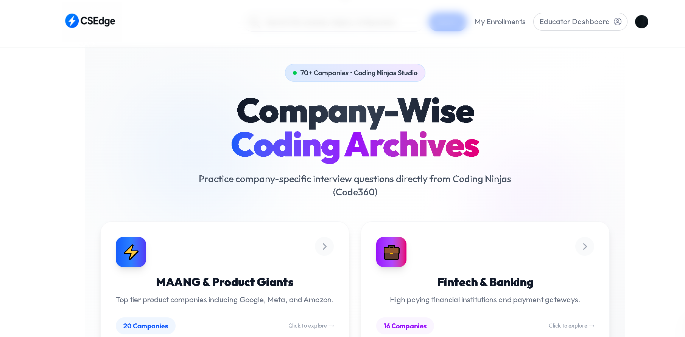
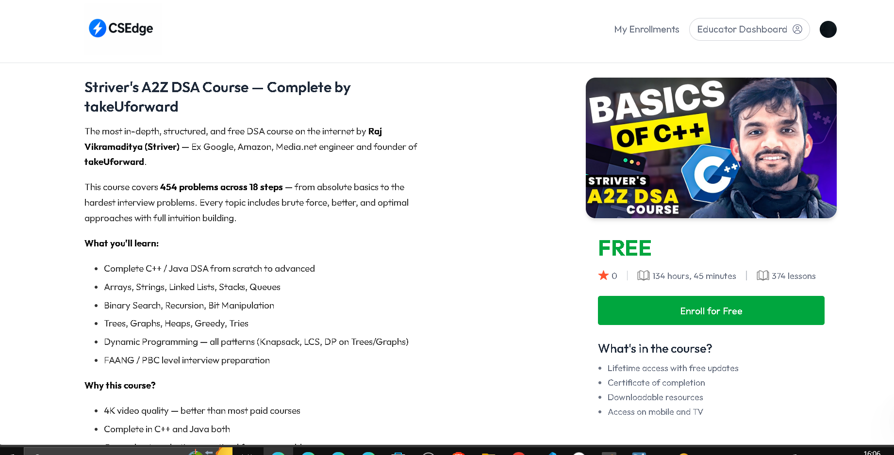
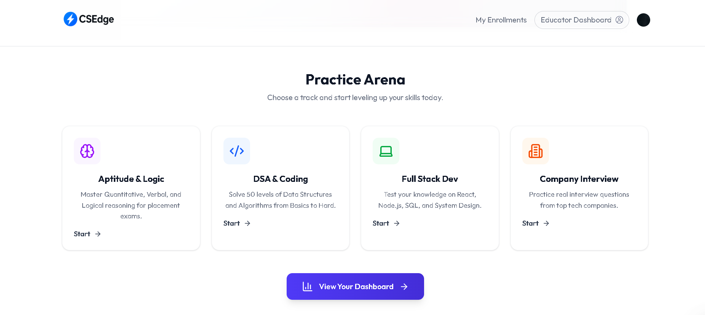
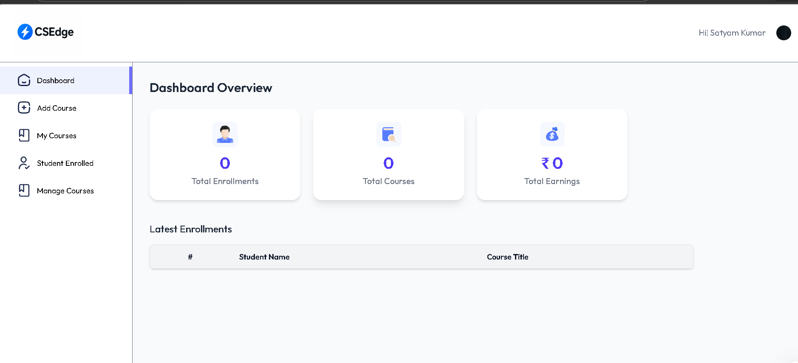

<div align="center">


# ⚡ CSEdge — Full Stack Learning & Placement Platform

### *Learn Smart. Prepare Right. Succeed Big.*

[](https://react.dev)
[](https://nodejs.org)
[](https://mongodb.com)
[](https://stripe.com)
[](https://clerk.com)
[](https://tailwindcss.com)
[](https://cloudinary.com)

<br/>

> A production-grade **Learning Management System** built for CS students preparing for placements.
> Combines video courses, multi-category practice tests, company-wise interview prep,
> and separate educator/student dashboards — all in one platform.

<br/>

[🚀 Live Demo](https://csedge-frontend.vercel.app/) &nbsp;•&nbsp; [📸 Screenshots](#-screenshots) &nbsp;•&nbsp; [⚙️ Setup](#-getting-started) &nbsp;•&nbsp; [🏗️ Architecture](#-architecture)

</div>

---

## 📸 Screenshots

> Add your actual screenshots in a `/screenshots` folder and update the paths below.

| Home Page | Course Player |
|-----------|--------------|
|  |  |

| Practice Tests | Company Interview Prep |
|---------------|----------------------|
|  |  |

| Educator Dashboard | Student Enrollments |
|-------------------|-------------------|
|  |  |

---

## ✨ Features

### 🎓 For Students
- **Video Courses** — Watch YouTube-embedded lectures directly inside the platform (no redirect)
- **Chapter-wise Progress** — Track completed lectures with a visual progress bar
- **Free & Paid Courses** — Free courses enroll instantly; paid courses go through Stripe Checkout
- **Practice Tests** — 4 categories × 50 levels × 15 questions each
- **Company Interview Prep** — 70+ companies grouped by sector (MAANG, Fintech, Startups, etc.)
- **My Enrollments** — All enrolled courses in one place with resume support
- **Ratings** — Rate courses with a star rating system

### 👩‍🏫 For Educators
- **Course Builder** — Add courses with chapters, lectures, thumbnails, and pricing
- **Student Analytics** — See total enrollments, earnings, and student list
- **Publish / Unpublish** — Control course visibility with a toggle
- **Manage Courses** — Full CRUD (create, edit, delete) from the admin panel

### 🛡️ Platform
- **Clerk Authentication** — Social login, JWT-secured API, auto user creation
- **Stripe Payments** — Checkout sessions, webhook-verified enrollment
- **Cloudinary** — Image & thumbnail uploads
- **Role-based Access** — Student / Educator / Admin roles
- **Responsive Design** — Works on mobile, tablet, and desktop

---

## 🏗️ Architecture

```
csedge/
├── client/                        # React Frontend (Vite)
│   ├── src/
│   │   ├── pages/
│   │   │   ├── student/           # Home, CourseList, CourseDetails, Player, MyEnrollments
│   │   │   ├── educator/          # Dashboard, MyCourses, AddCourse, StudentEnrolled
│   │   │   ├── AptitudeTest.jsx   # 50-level aptitude tests
│   │   │   ├── CodingTest.jsx     # DSA coding challenges
│   │   │   ├── DevTest.jsx        # Full-stack dev questions
│   │   │   └── CompanyInterview.jsx # Company-wise prep (6 categories, 70+ companies)
│   │   ├── components/
│   │   │   ├── student/           # Navbar, CourseCard, CoursesSection, Hero, Footer
│   │   │   └── educator/          # Sidebar, Navbar, Dashboard widgets
│   │   ├── context/
│   │   │   └── AppContext.jsx     # Global state — courses, user, auth helpers
│   │   ├── admin/
│   │   │   └── AdminCourses.jsx   # Full CRUD course management panel
│   │   └── utils/
│   │       └── axios.js           # Axios instance with base URL
│
└── server/                        # Node.js + Express Backend
    ├── models/
    │   ├── user.js                # User schema (enrolledCourses, role)
    │   ├── course.js              # Course → chapters → lectures (nested)
    │   ├── Purchase.js            # Stripe purchase records
    │   ├── CourseProgress.js      # Per-user lecture completion tracking
    │   ├── TestAttempt.js         # Test session records
    │   ├── TestProgress.js        # Level unlock tracking
    │   └── ExternalProblem.js     # User-saved problem links
    ├── controllers/
    │   ├── userController.js      # Auth, enrollment, progress, ratings
    │   ├── courseController.js    # Course CRUD, publish toggle
    │   ├── educatorController.js  # Educator stats and management
    │   ├── testController.js      # Questions, attempts, scoring
    │   ├── adminController.js     # Admin-level overrides
    │   └── webhooks.js            # Stripe webhook handler
    ├── routes/
    │   ├── app-user-routes.js
    │   ├── app-course-routes.js
    │   ├── app-educator-routes.js
    │   ├── app-test-routes.js
    │   ├── app-admin-routes.js
    │   └── app-company-articles-routes.js
    ├── middleware/
    │   └── authMiddleware.js      # Clerk requireAuth + role protection
    └── server.js                  # Express app entry point
```

---

## 🧰 Tech Stack

| Layer | Technology | Purpose |
|-------|-----------|---------|
| **Frontend** | React 18 + Vite | UI framework with fast HMR |
| **Styling** | Tailwind CSS | Utility-first responsive design |
| **Routing** | React Router v6 | Client-side navigation |
| **Auth** | Clerk | JWT auth, OAuth, session management |
| **State** | React Context API | Global course/user state |
| **Backend** | Node.js + Express | REST API server |
| **Database** | MongoDB + Mongoose | Document storage for nested data |
| **Payments** | Stripe | Checkout sessions + webhooks |
| **Media** | Cloudinary | Thumbnail/image hosting |
| **Video** | YouTube Embed API | In-platform video playback |
| **Icons** | Lucide React | Consistent icon library |
| **Notifications** | React Toastify | User feedback toasts |
| **Deployment** | Vercel (client) + Railway/Render (server) | Cloud hosting |

---

## 🗄️ Database Schema (Key Models)

### Course
```js
{
  courseTitle: String,
  courseDescription: String,     // Rich HTML
  courseThumbnail: String,       // Cloudinary URL
  coursePrice: Number,
  discount: Number,              // 0–100 percent
  isPublished: Boolean,
  educator: String,              // Clerk userId
  enrolledStudents: [String],
  courseRatings: [{ userId, rating }],
  courseContent: [{              // Chapters
    chapterId, chapterTitle, chapterOrder,
    chapterContent: [{           // Lectures
      lectureId, lectureTitle, lectureUrl,   // YouTube embed URL
      lectureDuration, isPreviewFree, lectureOrder
    }]
  }]
}
```

### User
```js
{
  _id: String,                   // Clerk userId
  name, email, imageUrl,
  enrolledCourses: [ObjectId],   // ref: Course
  role: String                   // student | educator | admin
}
```

### Purchase
```js
{
  courseId, userId,
  amount: Number,                // 0 for free courses
  status: String,                // pending | completed | failed
  stripeSessionId: String
}
```

---

## ⚙️ Getting Started

### Prerequisites
- Node.js 18+
- MongoDB (local or Atlas)
- Clerk account → [clerk.com](https://clerk.com)
- Stripe account → [stripe.com](https://stripe.com)
- Cloudinary account → [cloudinary.com](https://cloudinary.com)

### 1. Clone the repository
```bash
git clone https://github.com/YOUR_USERNAME/csedge.git
cd csedge
```

### 2. Setup the Server
```bash
cd server
npm install
```

Create `server/.env`:
```env
MONGODB_URI=mongodb+srv://your-cluster-url
CLERK_SECRET_KEY=sk_test_xxxxxxxxxxxx
STRIPE_SECRET_KEY=sk_test_xxxxxxxxxxxx
STRIPE_WEBHOOK_SECRET=whsec_xxxxxxxxxxxx
CLOUDINARY_CLOUD_NAME=your-cloud-name
CLOUDINARY_API_KEY=your-api-key
CLOUDINARY_API_SECRET=your-api-secret
CURRENCY=inr
PORT=5000
```

```bash
npm run dev
```

### 3. Setup the Client
```bash
cd ../client
npm install
```

Create `client/.env.local`:
```env
VITE_CLERK_PUBLISHABLE_KEY=pk_test_xxxxxxxxxxxx
VITE_BACKEND_URL=http://localhost:5000
```

```bash
npm run dev
```

### 4. Seed the Courses (optional)
```bash
cd server
node scripts/seedCourses.js
```

This seeds 4 real YouTube playlist courses:
- ⚡ Namaste JavaScript (Akshay Saini)
- ⚛️ Chai aur React (Hitesh Choudhary)
- 💻 DSA with C++ (Apna College)
- 🌐 Full Stack Web Dev Bootcamp

### 5. Configure Stripe Webhook (local testing)
```bash
# Install Stripe CLI
stripe listen --forward-to localhost:5000/stripe
```

---

## 🔌 API Reference

### User Routes — `/api/user`
| Method | Endpoint | Description |
|--------|----------|-------------|
| GET | `/data` | Get current user profile |
| GET | `/enrolled-courses` | Get all enrolled courses |
| POST | `/purchase` | Create Stripe checkout session |
| POST | `/enroll-free` | Directly enroll in a free course |
| POST | `/update-course-progress` | Mark lecture as completed |
| POST | `/get-course-progress` | Get progress for a course |
| POST | `/add-rating` | Rate a course (1–5 stars) |
| GET | `/dashboard` | Get test stats and course counts |

### Course Routes — `/api/course`
| Method | Endpoint | Description |
|--------|----------|-------------|
| GET | `/all` | Get all published courses |
| GET | `/:id` | Get single course with content |

### Educator Routes — `/api/educator`
| Method | Endpoint | Description |
|--------|----------|-------------|
| GET | `/courses` | Get educator's own courses |
| POST | `/add-course` | Create new course |
| PUT | `/update-course/:id` | Update course details |
| DELETE | `/delete-course/:id` | Delete a course |
| GET | `/dashboard` | Get earnings and enrollments |

### Test Routes — `/api/test`
| Method | Endpoint | Description |
|--------|----------|-------------|
| GET | `/questions` | Get questions by type and level |
| POST | `/attempt` | Submit test answers |
| GET | `/progress/:type` | Get unlocked levels |

---

## 🧪 Practice Test System

```
4 Categories × 50 Levels × 15 Questions = 3,000+ Questions

┌─────────────────┬──────────────────────────────────────────┐
│ Category        │ Coverage                                 │
├─────────────────┼──────────────────────────────────────────┤
│ Aptitude        │ Quant, Verbal, Logical Reasoning         │
│ DSA & Coding    │ Arrays → Graphs → DP (50 levels)        │
│ Full Stack Dev  │ HTML/CSS/JS/React/Node/MongoDB           │
│ Company-wise    │ Google, Amazon, Microsoft, etc.          │
└─────────────────┴──────────────────────────────────────────┘

Level unlock: Score ≥ 70% to unlock the next level
```

---

## 🔐 Authentication Flow

```
User visits app
      │
      ▼
Clerk handles login (Google / GitHub / Email)
      │
      ▼
JWT token stored in browser
      │
      ▼
Every API request: Authorization: Bearer <token>
      │
      ▼
Server: requireAuth() middleware validates token
      │
      ▼
req.auth().userId → fetch/create user in MongoDB
```

---

## 💳 Payment Flow

```
Student clicks "Buy Now"
        │
        ▼
POST /api/user/purchase
        │
        ├─ Free course (price = 0)?
        │       │
        │       ▼
        │  POST /api/user/enroll-free
        │  → Add to enrolledCourses directly
        │  → Redirect to Player
        │
        └─ Paid course?
                │
                ▼
          Stripe Checkout Session created
                │
                ▼
          User completes payment on Stripe
                │
                ▼
          Stripe webhook → /stripe
                │
                ▼
          Purchase status → "completed"
          User.enrolledCourses updated
                │
                ▼
          Redirect to My Enrollments
```

---

## 🤝 Contributing

Contributions are welcome! Here's how:

```bash
# Fork the repo, then:
git checkout -b feature/your-feature-name
git commit -m "feat: add your feature"
git push origin feature/your-feature-name
# Open a Pull Request
```

Please follow [Conventional Commits](https://www.conventionalcommits.org/) for commit messages.

---

## 📄 License

This project is licensed under the **MIT License** — see the [LICENSE](LICENSE) file for details.

---

## 👨‍💻 Author

**Satyam Kumar**

[](https://github.com/yourusername)
[](https://linkedin.com/in/yourusername)

---

<div align="center">

⭐ **Star this repo if you found it helpful!** ⭐

*Built with ❤️ for CS students aiming for their dream companies*

</div>
